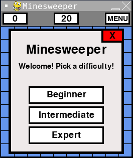
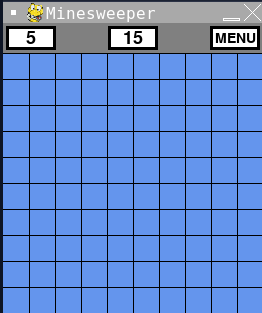
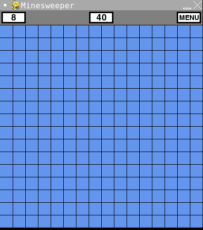
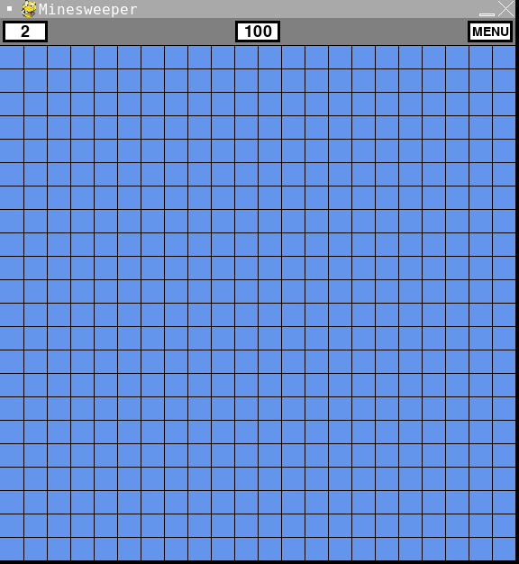
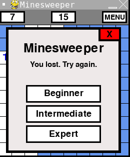
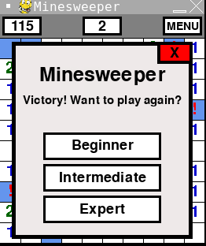

# Algorithm and Programming - Final Project : Mine Sweeper

Minesweeper is a logic-based single-player computer game played on a rectangular board. The objective is to find a specified number of randomly placed "mines" in the shortest possible time by clicking on "safe" squares while using squares and avoid mines. The game ends when the player clicks on a mine. 

### Video Demo: https://drive.google.com/drive/folders/1y282dkv4K0KenuWjiOr1vbvymCvhvD0n?usp=sharing

## How to use the program
All you need to do is run the maingame code. Then the program will immediately start with the starting screen, where you can pick 3 difficulties: Beginner, Intermediate and Expert.

Different levels have different grids with timer on the left, the number of mines that haven't been found and the menu button that asks whether the player wants to start a new game or not.

This is an example of how the Beginner level looks like. It has a 10x10 grid (total of 100 boxes) with 15 mines

This is an example of how the Intermediate level looks like. It has a 16x16 grid (total of 256 boxes) with 40 mines

This is an example of how the Expert level looks like. It has a 22x22 grid (total of 484 boxes) with 100 mines

This is what happens if you lost the game

This is what happens if you win the game

This is what happens if you press the menu button. It can pause the game too. (stops the timer)

##### Have fun!
